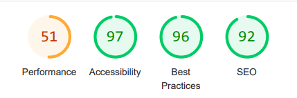
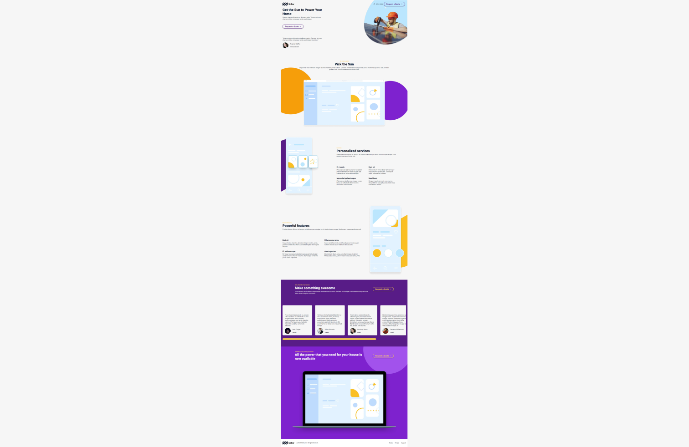

# Soller

## Deploy

Access the [Live Demo](https://igorchaves-soller.vercel.app/) or copy the URL directly: `https://igorchaves-soller.vercel.app/

## Lighthouse

## Layout preview

## Technologies

- TypeScript
- React.js
- Styled-components
- Framer motion
- React Helmet

## How to Use

**Running app:**

-   Clone this repository to your computer
-   Install dependencies using the command: `pnpm i`
-   Start the development server with: `pnpm dev`
-   Open your browser and navigate to: `http://localhost:3000`